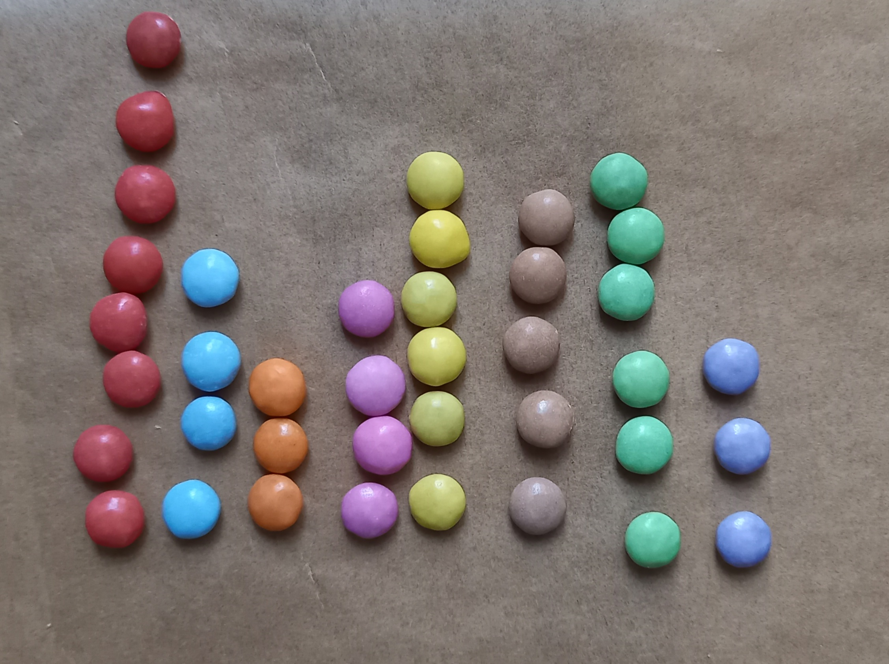

```{r setup, include=FALSE}
library(tidyverse)
knitr::opts_chunk$set(echo = FALSE)
knitr::opts_chunk$set(fig.pos = "!H", out.extra = "") # prevent LaTeX tables from floating around

source("R/helper.R")
source("R/mcnemar.R")
source("R/chisq.R")

include_solution <- params$include_solution

empty_str <- "\\ "

```

Sie haben eine Packung mit Zucker umhüllter Schokolinsen eines bekannten Herstellers gekauft. Sie wissen, dass diese Linsen in acht Farben hergestellt werden und Sie finden folgende Verteilung in der gekauften Packung:

{width="588"}

```{r, results="asis"}
source("R/chisq.R")

csq <- generate_chisq_uni(
  obs = c(8,4,3,4,6,5,6,3),
  exp_relative = rep(1/8,8),
  labels=c("rot","blau","orange","rosa","gelb","braun","grün","lila")
)


```

Sie fragen sich nun, ob bestimmte Farben in größeren Mengen hergestellt werden (oder alternative Erklärung: Die Farben werden im Werk in gleichen Mengen hergestellt). Führen Sie einen Chi-Quadrat-Test durch, um diese Frage zu untersuchen.

```{r, results="asis"}
cat(chisq_crit(csq,undirected = TRUE))
```

```{r, results="asis", eval=include_solution}
cat("_Lösung:_\n\n")

cat("Zunächst bestimmen wir durch Zählen die absoluten Häufigkeiten und halten diese in einer Tabelle fest:")
chisq_uni_data_table(csq) 

cat("Dann berechnen wir die erwarteten Häufigkeiten pro Farbe unter der Annahme einer Gleichverteilung:")
wrap_math_align(solution_chisq_uni(csq,1))

cat("Nun berechnen wir eine Teststatistik, die die Abweichung der Beobachtungen von den erwarteten Häufigkeiten erfasst:")
wrap_math_block(solution_chisq_uni(csq,2))
cat("\n")
cat(chisq_crit(csq))
cat("Wir können die Nullhypothese nicht ablehnen. Es wurde keine signifikante Abweichung von der Gleichverteilung festgestellt.")

cat("Die Wahrscheinlichkeit, eine mindestens so große Abweichung von der Gleichverteilung zu beobachten unter der Annahme, dass die Nullhypothese wahr ist (also eine Gleichverteilung der Farben gegeben ist), liegt bei ", pchisq(csq$chisq,df=csq$df))
```
